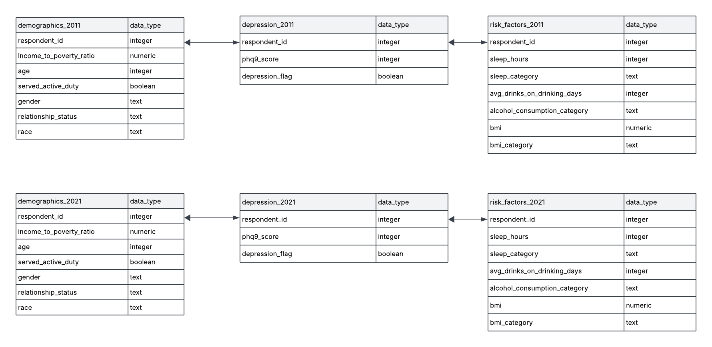
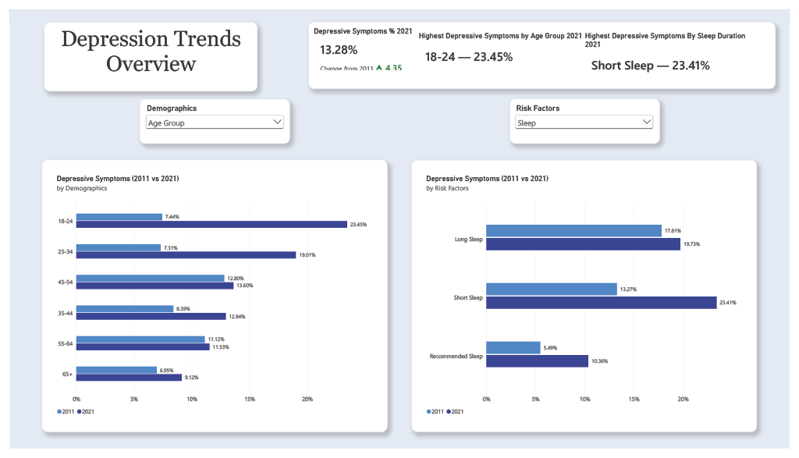

# NHANES-Depression-Analysis
I developed a Power BI dashboard using NHANES data to analyze changes in depressive symptoms between 2011 and 2021. The project covered the analysis process end to end: data cleaning and preparation, SQL analysis, dashboard design, and a written report translating the findings into clear insights.

# Project Background

Over the past decade, mental health has become a growing focus of public concern in the United States, even as the country has seen continued advances in technology, healthcare, and overall standard of living. Depression in particular has drawn increasing attention: it affects quality of life and daily functioning, and unlike many physical health conditions, it can be difficult to identify and measure.

The [National Health and Nutrition Examination Survey (NHANES)](https://www.cdc.gov/nchs/nhanes/about/index.html) collects health and nutrition data through continuous two-year survey cycles to assess the health and nutrition of adults and children in the United States.

This project analyzes depressive symptoms alongside demographic characteristics and health risk factors using data from the **2011–2012 and 2021–2023 NHANES survey cycles**. The goal is to examine how the prevalence of depressive symptoms has changed over the past decade and identify the factors most strongly associated with differences in that prevalence.

**[View the Interactive Power BI Dashboard →](Nhanes-Depression-Dashboard.pbix)**

**[View Targeted SQL Analysis →](./SQL/03_highlight_queries.sql)**

---

# Data Structure Overview

**Data Source:** [NHANES](https://wwwn.cdc.gov/nchs/nhanes/) — 2011–2012 and 2021–2023 cycles

## Data Definitions

**Relationship Status:** Categorization of marital and living arrangements.

* **Partnered:** Married or living with a partner
* **Separated:** Widowed, divorced, or separated
* **Never Married:** Never married

**PHQ-9 Score:** A 9-item questionnaire used to assess the severity of depressive symptoms over the previous two weeks. Scores range from 0–27, with higher scores indicating greater symptom severity. A score of ≥10 is classified as moderate-or-greater depressive symptoms.

**Depression Flag:** Binary value where a PHQ-9 score ≥10 is represented as 1, indicating moderate-or-greater depressive symptoms, while scores below 10 are represented as 0.

**Sleep Category:** Categorization of average daily sleep duration. Recommended represents 7–9 hours of sleep, Short represents fewer than 7 hours, and Long represents more than 9 hours.

**BMI Category:** Categorization of body mass index (BMI) based on standard adult BMI ranges. Underweight represents a BMI below 18.5, Normal represents 18.5–24.9, Overweight represents 25.0–29.9, and Obese represents 30.0 or higher.

**Alcohol Category:** Categorization based on the average number of alcoholic drinks consumed per drinking day, rather than an average across the week. For males, Moderate represents 1–2 drinks per drinking day, Above Moderate represents 3–4 drinks per drinking day, and Heavy represents 5 or more drinks per drinking day. For females, Moderate represents 1 drink per drinking day, Above Moderate represents 2–3 drinks per drinking day, and Heavy represents 4 or more drinks per drinking day.

**Average Drinks per Drinking Day:** The average number of alcoholic drinks consumed on days when alcohol was consumed. This measure reflects drinking days only and is not an average of alcohol consumption across all days of the week.

**Income-to-Poverty Ratio:** The ratio of family income to the federal poverty threshold for that family's size. A ratio of 1.0 indicates income at the poverty line. Adults were grouped into four categories.

* **Below Poverty:** Ratio below 1.0
* **Low Income:** Ratio of 1.0 to 1.99
* **Middle Income:** Ratio of 2.0 to 3.99
* **High Income:** Ratio of 4.0 or higher

---

# Executive Summary

## Overview of Findings

Over the past decade, patterns in depressive symptoms have shifted substantially across the U.S. adult population. The prevalence of moderate-or-greater depressive symptoms increased from **8.93% in 2011 to 13.28% in 2021**.

Among demographic groups, younger adults experienced some of the largest increases in depressive symptoms, particularly those aged 18–24 and 25–34. With **18–24 rising from 7.44% in 2011 to 23.45% in 2021**, and **25–34 showing a similar rise from 7.31% to 19.01%**.

Income showed a clear gradient, with the prevalence of moderate-or-greater depressive symptoms decreasing at each higher **income-to-poverty group**. Adults **below the poverty line** had the highest prevalence at **22.31%**, compared with just **7.10% among those in the high-income group**.

Sleep duration also showed a notable association with depressive symptoms. In 2021, **23.41%** of adults reporting less than the **recommended 7–9 hours of sleep** had moderate-or-greater depressive symptoms, more than double the **10.36%** among those reporting **recommended sleep**.

Alcohol consumption showed a similar pattern. **20.86%** of adults in the **heavy alcohol-consumption category** had moderate-or-greater depressive symptoms, more than double the **8.66%** among those in the **moderate category**.

### Dashboard Overview

**[View the Interactive Power BI Dashboard →](Nhanes-Depression-Dashboard.pbix)**

---

## Demographic Trends

**Age:** The rise in depressive symptoms since 2011 has been driven largely by younger adults. Prevalence among adults 18–24 roughly tripled to 23.45%, and among adults 25–34 it more than doubled to 19.01%, leaving both groups well above everyone else. In 2021, adults 18–24 sat nearly 10 points above any group 35 and older, a striking reversal from 2011, when they were among the lowest.

**Relationship Status:** Relationship status showed a similar divide. Never-married adults consistently reported more elevated symptoms than partnered adults, and by 2021 the gap had widened to more than double (**19.63% vs. 8.99%**). This suggests that social isolation may be an important factor in the increase in depressive symptoms.

**Income:** Income followed a clear gradient in both cycles, with elevated symptoms becoming less common at each step up the income ladder. Adults below the poverty line were the most affected, while middle- and high-income adults reported the lowest levels. The differences are striking, it seems income is strongly associated with depressive symptoms. *(will mention direct numbers here)*

---

## Risk Factor Trends

**Sleep:** Sleep drew one of the sharpest lines between adults with elevated and lower symptoms. In 2021, adults with elevated symptoms were twice as likely to report short sleep (**26.06% vs. 13.06%**), while those with lower symptoms were considerably more likely to get the recommended amount (**77.16% vs. 58.25%**). Viewed by sleep group instead, 23.41% of adults sleeping less than the recommended 7–9 hours had moderate-or-greater depressive symptoms, more than double the rate among those getting recommended sleep (**10.36%**). Long sleep followed a similar pattern: 19.73% of adults sleeping more than 9 hours had moderate-or-greater symptoms, nearly double the recommended-sleep rate and not far below that of short sleepers. In 2011, long sleepers in fact had the highest prevalence of any sleep group (**17.81%**, compared with **13.27%** for short sleep), suggesting that sleep at either extreme, not just short sleep, is associated with depressive symptoms.

**Alcohol:** Alcohol pointed the same way. In 2021, heavy drinking was nearly twice as common among adults with elevated symptoms as among those with lower symptoms (**27.04% vs. 14.53%**), even though it became less common in both groups over the decade. The prevalence figures tell the same story: **20.86%** of heavy drinkers had moderate-or-greater symptoms compared with just **8.66%** of moderate drinkers, and the increase since 2011 was largest among heavy drinkers (**12.85% to 20.86%**).

**BMI:** BMI appears to have a much weaker association with depressive symptoms. In 2021, obese adults had the highest prevalence among the larger BMI groups (**15.14%**), but only modestly above normal-weight (**11.60%**) and overweight (**11.21%**) adults, a much smaller difference than those seen for sleep or alcohol. Symptoms rose in every BMI group over the decade, including obese (**12.26% to 15.14%**) and overweight (**6.80% to 11.21%**) adults.

---

## Implications

These findings are descriptive and cannot establish cause, but they suggest where attention may be most valuable. Younger adults (18–34) and adults with the lowest incomes showed the highest prevalence of elevated symptoms, making them natural focal points for screening and outreach. Sleep, at both extremes, and heavy drinking showed the strongest associations among the risk factors examined, suggesting they may be useful early indicators to monitor. Further analysis could adjust for age and test whether these associations hold when factors are considered together.

---

# Limitations

## Survey Design and Data

* **Survey weights:** NHANES uses a complex, multistage sampling design and provides survey weights so that estimates represent the U.S. population. Weights were not applied, so percentages describe the survey sample and may not fully represent the U.S. adult population.

* **Sample sizes:** Some subgroups, such as the underweight BMI category, contain relatively few respondents, which makes their estimates less stable. For this reason, the underweight group is not discussed in the findings.

* **Timing and COVID-19:** The 2021–2023 cycle was used because the 2021–2022 cycle was disrupted by the COVID-19 pandemic. The comparison is therefore between two time points roughly a decade apart, and the later cycle follows the pandemic. The increase in depressive symptoms may reflect pandemic-related effects as well as longer-term trends, and this analysis cannot separate the two.

* **Changes in survey questions:** Some questions were revised or reworded between cycles, which made it difficult to identify measures that could be compared consistently. The variables analyzed were limited to those available in both cycles, so other potentially relevant factors are not represented.

* **Missing responses:** Respondents did not answer every question, so records with missing values for a given variable were excluded from analyses involving that variable. A respondent could have a valid sleep response but no alcohol response, for example, so group sizes vary across comparisons and results may be biased if missing answers are not random.

* **Alcohol categories:** Alcohol categories are based on average drinks per drinking day rather than overall weekly or monthly consumption. Two people with very different drinking frequency could land in the same category, and the categories only cover respondents who drink, so there is no comparison with non-drinkers.

## Measurement and Analysis

* **Self-reported screening measure:** PHQ-9 is a self-reported screening questionnaire, and a score of ≥10 indicates probable elevated symptoms rather than a clinical diagnosis. Sleep and alcohol are also self-reported.

* **No causal conclusions:** Each cycle is a separate cross-sectional sample, so the analysis shows associations, not cause or direction. Poor sleep or heavy drinking could contribute to depressive symptoms, result from them, or both.

* **Unadjusted comparisons:** Each factor was examined on its own without controlling for the others. For example, the relationship-status gap may partly reflect age, since never-married adults tend to be younger.

